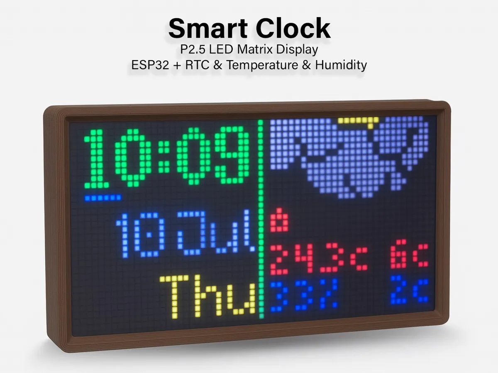
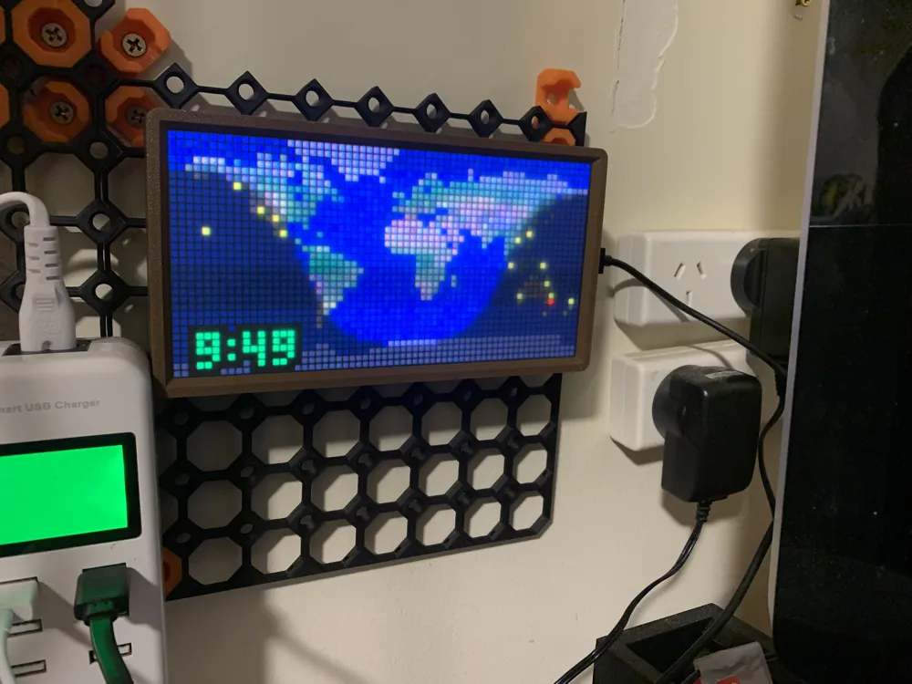

<div align="center">
  

  # Carlson's Smart Clock — Software

  ### Your clock. Your settings. Your network.

  A colourful 64 × 32 LED matrix clock whose settings live on the clock itself.
  Open its local web page from your phone or computer to make it yours. No
  account, companion app, cloud dashboard or subscription is required for the
  clock, its display, or its controls.

  [Get the software](#get-the-software) · [See the screens](#thirteen-ways-to-see-the-time) ·
  [Build the hardware](https://github.com/LORDSn1per/Carlsons-Smart-Clock-Hardware) ·
  [Print the enclosure](https://makerworld.com/en/models/1593477-p2-5-matrix-smart-clock#profileId-1678436)
</div>

---

## Full control, right where the clock sits

The ESP32 hosts its own settings page on your local network. Pick a screen,
change its colours and elements, set a schedule, tune brightness, choose your
timezone and update firmware in a browser. Your choices are saved on the clock.
The physical menu button and on-screen QR code help you find the page again.

The clock can keep time from its battery-backed DS3231 real-time clock when
Wi-Fi or the internet is unavailable. Wi-Fi is used for setup, network time
sync and optional live weather. Weather data comes from a provider you choose;
it may require that provider's API key and is subject to its own limits or
pricing. **The clock itself has no subscription requirement.**

## Thirteen ways to see the time

| Screen | What it shows |
|---|---|
| 1 — Classic Digital | Time, date and weather at a glance |
| 2 — Alt. Digital | A larger weather-focused digital layout |
| 3 — Analog | Analogue clock and calendar |
| 4 — World Map | Animated day/night terminator and city lights |
| 5 — Moon Phase | The current moon and illumination |
| 6 — Gradient Clock | Animated colour gradient |
| 7 — Digital Watch | Compact watch-inspired face |
| 8 — Color Analog | Full analogue face with configurable hands and marks |
| 9 — Nixie Tube | A digital take on classic tube numerals |
| 10 — Rainline | Hourly rain-chance graph |
| 11 — Sunpath | Sunrise and sunset timeline |
| 12 — Wind Dial | Wind direction and speed |
| 13 — Infographic | Rotating sun, rain, wind and forecast modules |

<p align="center"></p>

You can select a face directly or schedule different faces for different times
of day. Every face has its own controls for the details that suit it, including
colour, time format, seconds, weather icons and graph style. Screen 13 lets you
choose its modules and transition. The rain views can use 15-minute probability
data when Pirate Weather supplies it.

## More of what it does

- **Brightness that fits the room.** Set it manually or calibrate the LDR-based
  automatic brightness for your dark and bright rooms.
- **Weather on your terms.** Choose Pirate Weather, OpenWeatherMap or
  WeatherAPI.com, set a location, select Celsius or Fahrenheit and choose
  actual or feels-like temperature. Indoor temperature and humidity come from
  the AHT10 sensor, with an indoor temperature offset.
- **Flexible time and language.** Network time sync, a battery-backed RTC,
  timezone selection, 12/24-hour formats, and English, German and Swedish UI
  options.
- **Updates without losing your setup.** Upload firmware from the local web
  page, use Arduino OTA, or flash over USB. A normal USB update keeps the
  settings partition; a full erase is an explicit separate choice.
- **Hardware you can make.** ESP32, HUB75 P2.5/P5 64 × 32 panel, sensors, PCB
  files and a printable enclosure. See the
  [hardware repository](https://github.com/LORDSn1per/Carlsons-Smart-Clock-Hardware).

## Get the software

The [latest release](https://github.com/LORDSn1per/Carlsons-Smart-Clock-Software/releases/latest)
contains a complete `SmartClock_vX.XX.bin` image and Clock Builder packages for
macOS and Windows. Use a **complete** SmartClock image for first-time USB
flashing. Clock Builder checks the chip and image before writing, and offers an
update that keeps saved settings or a separately confirmed full erase.

| Platform | How to flash |
|---|---|
| macOS 12+ | Unzip Clock Builder, choose the SmartClock image, connect the ESP32 by USB, identify it and select **Update**. The current app is Intel-only (Apple Silicon needs Rosetta), ad-hoc signed and not notarised. It uses PlatformIO's esptool; see [Mac requirements](ClockBuilder/README.md). |
| Windows 10/11 (x64) | Unzip the complete Windows package, keep `esptool.exe` beside Clock Builder, then identify and update. The Windows USB path still needs testing on a physical Windows PC; see [Windows notes](ClockBuilderWindows/README.md). |
| Linux or manual USB | Flash the complete image at offset `0x0` with esptool. See the [developer guide](docs/DEVELOPMENT.md#flashing-a-blank-esp32). |

After flashing, connect to the clock's temporary `Clock-###` Wi-Fi network and
open `192.168.4.1` if the setup portal does not appear automatically. Choose
your Wi-Fi network. Once connected, use the QR code or the local IP shown on the
clock to open its settings page. The [hardware build guide](https://github.com/LORDSn1per/Carlsons-Smart-Clock-Hardware/blob/main/BUILD_GUIDE.md)
walks through the whole process.

## How it fits together

```text
Phone / computer ──local Wi-Fi──► clock's web settings page
                                     │
             ESP32 ──HUB75──► 64 × 32 LED matrix
               │
               ├── DS3231 RTC ──► time through network outages
               ├── AHT10 ───────► indoor temperature and humidity
               └── LDR ─────────► ambient-light brightness control

Optional: NTP for time sync; your chosen weather API for live forecasts.
```

## For developers

The firmware source, embedded web page, Mac and Windows Clock Builder source,
vendored libraries and build scripts are all in this repository. Start with the
[developer guide](docs/DEVELOPMENT.md), then see the [changelog](CHANGELOG.md).
The PlatformIO project pins Arduino-ESP32 2.x because the included HUB75 driver
uses the older I²S peripheral interface. The Git history is the local firmware
development history, published here without the large archive of every build.

The enclosure files are distributed through
[my MakerWorld profile](https://makerworld.com/en/models/1593477-p2-5-matrix-smart-clock#profileId-1678436)
under that model's download terms. Photos on this page come from the same
listing.
